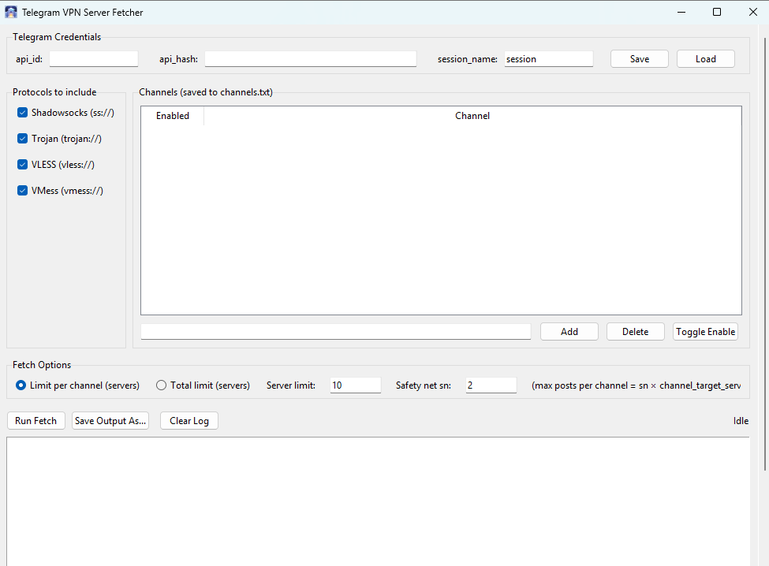

# v2rayFetcher

**v2rayFetcher** is a Windows desktop application that lets you collect VPN server links from multiple Telegram channels automatically, using a simple graphical interface.

It is designed for users who want to gather V2Ray-compatible servers (VLESS, VMess, Trojan, Shadowsocks) in bulk without manually browsing Telegram channels.

---

## Download

1. Go to the **Releases** section of this repository
2. Download the latest `v2rayFetcher.exe`
3. Place the file in any folder on your system
4. Double-click the executable to run

> No Python installation is required.

---

## First Run

When you launch the application for the first time:

1. Enter your **Telegram API ID** and **API Hash**
2. Choose a **session name** (any name is fine)
3. Click **Run Fetch**
4. A login window will appear
5. Enter your **phone number**
6. Enter the **code** Telegram sends you
7. If prompted, enter your **Telegram password**

After logging in once, you will not be asked again unless the session is removed.

---

## Main Interface Overview

The application window is scrollable and divided into several sections:

- Protocol selection
- Channel management
- Fetch options
- Log output

A screenshot of the interface is shown above.

---

## Selecting Protocols

Choose which VPN protocols you want to collect:

- Shadowsocks
- Trojan
- VLESS
- VMess

Only server links using the selected protocols will be included in the results.

---

## Managing Channels

The **Channels** section lets you control where servers are fetched from.

### Add a Channel
1. Enter a Telegram channel username or link (e.g. `https://t.me/example`)
2. Click **Add**

### Enable / Disable a Channel
- Select a channel from the list
- Click **Toggle Enable**

Disabled channels are ignored during fetching.

### Delete a Channel
- Select a channel
- Click **Delete**

Your channel list is saved automatically and restored the next time you open the app.

---

## Choosing Fetch Mode

You can choose how many servers to collect using two modes:

### Per-Channel Limit
- The number you enter applies **to each enabled channel**
- Example:  
  `10` → fetch 10 servers from each channel

### Total Limit
- The number you enter is the **total server count**
- Servers are collected from all channels until the total is reached
- Example:  
  `200` → fetch approximately 200 servers across all channels

> The limit applies to **servers**, not posts.  
> If one post contains multiple servers, all are counted.

---

## Running the Fetch

1. Select protocols
2. Enable the channels you want
3. Choose a limit mode and number
4. Click **Run Fetch**

The log panel will show progress in real time.

---

## Output

- Results are automatically saved to a text file named with the current date  
